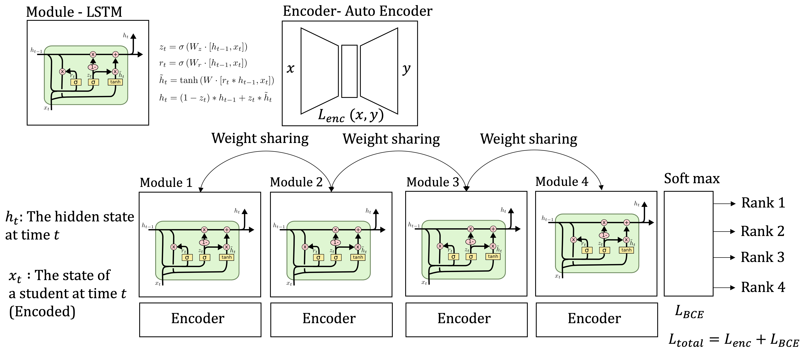

# KELS

## Dataset
- dataset from 한국교육개발원 한국교육종단연구(KELS2013)
- https://www.kedi.re.kr/khome/main/research/requestResearchData.do

## Preprocessing
- merge questions in same category (with codebook)
- used only categorical data (not continuous data)
- fill missing value with average of column
- label for L2Y6: 1,2,3,4,5,6,7,8,9
- number of preprocessed dataset:

## Dataloader
- dataset: KELS, sorted by L2SID
- sample {'year': [ year ], 'input':{columns_name:input}, 'label':{columns_name:label}}

## Baselines
- Logistic Regression
- Decision Tree
- Random Forest
- Support Vector Machine

## Models

